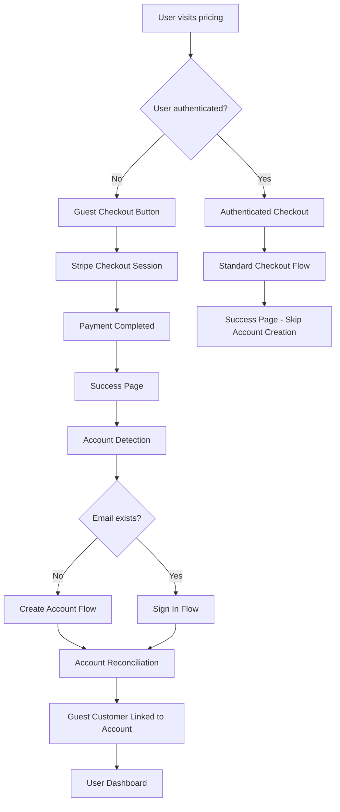

# Guest Checkout System - "Payment First, Account Later"

## Overview

The SaaS Kit implements a modern "Payment First, Account Later" checkout workflow that significantly reduces conversion friction by allowing users to complete payments without first creating an account. This system handles the complexities of guest checkout, payment processing, account creation, and payment reconciliation seamlessly.

## 🎯 Business Impact

**Traditional Flow Problems:**
- High abandonment rates at account creation step (typical 40-60% drop-off)
- User frustration with lengthy signup process
- Lost revenue from impulse purchases
- Complex onboarding flow

**New Guest Checkout Benefits:**
- ✅ **Reduced Friction**: Users can start paying immediately
- ✅ **Higher Conversion**: Eliminates signup barrier
- ✅ **Impulse Purchases**: Captures users in buying mood
- ✅ **Seamless UX**: Account creation happens post-purchase
- ✅ **Secure**: Full audit trail and reconciliation system

## 🏗️ System Architecture

### Core Components

```
┌─────────────────────────────────────────────────────────────┐
│                 Frontend Flow                               │
├─────────────────────────────────────────────────────────────┤
│  Pricing Page → Guest Checkout → Stripe Payment →          │
│  Success Page → Account Detection → Account Creation/Login │
└─────────────────────────────────────────────────────────────┘
                               │
┌─────────────────────────────────────────────────────────────┐
│                 Backend Services                            │
├─────────────────────────────────────────────────────────────┤
│  Guest Session Manager → Account Reconciliation Service    │
│  Enhanced Webhooks → Temporary Session Storage             │
└─────────────────────────────────────────────────────────────┘
                               │
┌─────────────────────────────────────────────────────────────┐
│                 Data Layer                                  │
├─────────────────────────────────────────────────────────────┤
│  Stripe Customer Data → Guest Sessions → User Accounts     │
│  Payment History → Audit Logs → Reconciliation Records     │
└─────────────────────────────────────────────────────────────┘
```

### Flow Diagram



## 🔧 Technical Implementation

### 1. Enhanced Checkout API (`/api/stripe/checkout`)

**Supports Two Modes:**
- **Authenticated Checkout**: Traditional flow for logged-in users
- **Guest Checkout**: New flow for anonymous users

**Key Features:**
- Automatic mode detection based on authentication status
- Secure session creation with guest metadata
- Proper Stripe customer handling for both modes
- Type-safe request/response handling

```typescript
interface CheckoutRequest {
  priceId: string;
  planName?: string;
  isGuest?: boolean;
  successUrl?: string;
  cancelUrl?: string;
}

interface CheckoutResponse {
  sessionId: string;
  url: string;
  customerId?: string;
}
```

### 2. Guest Session Manager (`lib/guest-session-manager.ts`)

**Responsibilities:**
- Secure temporary storage of guest checkout data
- Session expiration and cleanup (24-hour TTL)
- Account detection and matching
- Session consumption tracking

**Key Functions:**
```typescript
// Create secure guest session
createGuestSession(sessionData: GuestSessionData): Promise<boolean>

// Retrieve guest session with fallback to Stripe
getGuestSession(sessionId: string): Promise<GuestSessionData | null>

// Mark session as consumed after account linking
markSessionConsumed(sessionId: string, userId: string): Promise<boolean>

// Detect if customer is from guest checkout
isGuestCustomer(customerId: string): Promise<boolean>

// Cleanup expired sessions (automated)
cleanupExpiredSessions(): Promise<number>
```

### 3. Account Reconciliation Service (`lib/account-reconciliation.ts`)

**Core Purpose:** Links guest payments to user accounts securely

**Key Concepts:**
- **Customer Linking**: Instead of transferring payment methods, we link the guest customer to the authenticated user
- **Metadata Update**: Update guest customer with authenticated user information
- **Existing Customer Handling**: Mark any pre-existing customer as secondary
- **Simple & Reliable**: No complex payment method transfers or subscription migrations

**Implementation Details:**
```typescript
// Link guest customer to authenticated user
async function transferSubscriptionToExistingCustomer(
  request: ReconciliationRequest,
  paymentInfo: GuestPaymentInfo,
  existingCustomerId: string
): Promise<ReconciliationResult> {
  // Update the guest customer with the authenticated user's information
  await stripe.customers.update(paymentInfo.stripeCustomerId, {
    email: request.userEmail,
    metadata: {
      user_id: request.userId,
      reconciled_at: new Date().toISOString(),
      original_session: request.sessionId,
      account_type: 'converted_from_guest'
    }
  });
  
  // Update subscription metadata
  await stripe.subscriptions.update(paymentInfo.subscriptionId, {
    metadata: {
      user_id: request.userId,
      reconciled_at: new Date().toISOString()
    }
  });
  
  // Sync customer data to database
  await syncStripeCustomerData(paymentInfo.stripeCustomerId);
  
  return {
    success: true,
    message: 'Successfully linked subscription to your account',
    subscriptionLinked: true
  };
}
```

**Benefits of This Approach:**
- ✅ **No Complex Transfers**: Avoids all payment method transfer issues
- ✅ **Preserves Payment Methods**: Guest's payment method stays intact
- ✅ **Maintains Subscription**: No cancellation/recreation needed
- ✅ **Simple & Reliable**: Just metadata updates
- ✅ **Handles Edge Cases**: Works even if user had existing customer

### 4. Enhanced Success Page (`app/checkout/success/checkout-success.tsx`)

**Smart Account Detection:**
- Detects guest vs authenticated checkouts
- Extracts email from Stripe session
- Checks if email already exists in system
- Shows conditional UI based on account status

**UI Modes:**
- **New User**: Account creation form with password
- **Existing User**: Sign-in form with password
- **Authenticated User**: Standard success message

### 5. Updated Webhook Handler (`app/api/stripe/webhook/route.ts`)

**Enhanced Features:**
- Detects guest checkout sessions
- Creates temporary guest sessions
- Handles both guest and authenticated webhooks
- Automatic cleanup of expired sessions
- Comprehensive logging for audit trail

### 6. Reconciliation API (`app/api/reconcile-account/route.ts`)

**Security Features:**
- Requires authentication
- Validates session ownership
- Prevents unauthorized access
- Comprehensive error handling

## 🔐 Security Considerations

### Data Protection
- **Encrypted Storage**: Sensitive guest data encrypted at rest
- **Session Expiry**: 24-hour automatic cleanup
- **Access Control**: Authentication required for reconciliation
- **Input Validation**: Comprehensive validation on all inputs

### Audit Trail
- **Comprehensive Logging**: All operations logged with timestamps
- **Unique Session IDs**: Track every guest session
- **Operation History**: Complete reconciliation history
- **Error Tracking**: Failed operations logged for review

### Privacy Compliance
- **Data Minimization**: Only store necessary guest data
- **Automatic Cleanup**: Expired sessions removed automatically
- **Consent Tracking**: User consent recorded during account creation
- **Right to Deletion**: Support for data removal requests

## 🚀 User Experience

### Guest Checkout Flow

1. **Pricing Page**
   - Clear "Buy Now" buttons
   - No login requirement
   - Instant checkout access

2. **Stripe Checkout**
   - Standard Stripe payment form
   - Email collection for receipt
   - Secure payment processing

3. **Success Page**
   - Account detection based on email
   - Conditional UI for new vs existing users
   - Clear next steps

4. **Account Creation/Login**
   - For new users: Simple account creation
   - For existing users: Password login
   - Automatic payment linking

5. **Dashboard Access**
   - Immediate access to purchased features
   - Payment history available
   - Subscription management

### Error Handling

**Common Scenarios:**
- **Payment Failed**: Clear error messages with retry options
- **Email Conflicts**: Guided resolution with support options
- **Session Expired**: Graceful fallback with manual linking
- **Network Issues**: Retry mechanisms with user feedback

## 📊 Monitoring and Analytics

### Key Metrics to Track

**Conversion Metrics:**
- Guest checkout conversion rate vs authenticated
- Abandonment rate at each step
- Time to complete guest flow
- Account creation rate post-purchase

**Technical Metrics:**
- Guest session creation success rate
- Reconciliation success rate
- Webhook processing time
- Session cleanup efficiency

**Business Metrics:**
- Revenue from guest checkouts
- Customer lifetime value by acquisition method
- Support ticket volume for payment issues
- Feature adoption post-account creation

### Logging and Debugging

**Structured Logging:**
```typescript
console.log('[GUEST_CHECKOUT] Session created:', {
  sessionId,
  customerEmail,
  planName,
  timestamp: new Date().toISOString()
});
```

**Error Tracking:**
- All errors logged with context
- Correlation IDs for tracing
- Performance metrics captured
- User-friendly error messages

## 🧪 Testing Strategy

### Unit Tests
- Guest session manager functions
- Account reconciliation logic
- API endpoint validation
- Error handling scenarios

### Integration Tests
- Complete guest checkout flow
- Webhook processing
- Account linking scenarios
- Edge case handling

### End-to-End Tests
- Full user journey from pricing to dashboard
- Payment processing with test cards
- Account creation and login flows
- Cross-browser compatibility

## 🔄 Maintenance and Operations

### Regular Tasks
- **Monitor guest session storage**: Ensure cleanup is working
- **Review reconciliation logs**: Check for failed linkings
- **Update Stripe webhooks**: Ensure proper event handling
- **Performance monitoring**: Track API response times

### Troubleshooting

**Common Issues:**
1. **Failed Reconciliation**
   - Check session validity
   - Verify Stripe customer data
   - Review user account status
   - Manual linking if needed

2. **Webhook Delays**
   - Check Stripe webhook logs
   - Verify endpoint accessibility
   - Review event processing queue
   - Retry failed events

3. **Session Cleanup Issues**
   - Monitor cleanup logs
   - Check database performance
   - Verify cleanup schedule
   - Manual cleanup if needed

## 📈 Future Enhancements

### Planned Improvements
- **Enhanced Analytics**: More detailed conversion tracking
- **A/B Testing**: Test different guest checkout flows
- **Social Login**: Add guest social authentication
- **Mobile Optimization**: Enhanced mobile checkout experience
- **International Support**: Multi-currency and localization

### Scalability Considerations
- **Database Optimization**: Index optimization for large datasets
- **Caching Layer**: Redis for guest session storage
- **Queue System**: Background processing for reconciliation
- **Load Balancing**: Handle increased checkout volume

## 🤝 Development Guidelines

### Adding New Features
1. **Follow Existing Patterns**: Use established service patterns
2. **Comprehensive Testing**: Unit and integration tests required
3. **Security First**: Always validate and sanitize inputs
4. **Logging**: Add structured logging for debugging
5. **Documentation**: Update this guide with changes

### Code Review Checklist
- [ ] Security considerations addressed
- [ ] Error handling implemented
- [ ] Logging added for debugging
- [ ] Tests cover new functionality
- [ ] Documentation updated
- [ ] Performance impact assessed

### Adding New Features
```typescript
// Example: Extending the guest checkout system with new features
// 1. Update the reconciliation service if needed
import { reconcileGuestPayment } from '@/lib/account-reconciliation';

// 2. Add new endpoint or enhance existing one
export async function POST(request: Request) {
  // Implementation with proper error handling
}
```

### Common Pitfalls
- **Session Expiry**: Guest sessions expire after 24 hours; handle gracefully
- **Duplicate Reconciliation**: Implement idempotency to prevent double-processing
- **Payment Method Handling**: Ensure proper customer management with Stripe
- **Race Conditions**: Use atomic operations for guest-to-account transitions

## 🐛 Bug Fixes and Improvements

### Critical Issues Addressed

#### 1. Checkout Verification Date Handling
**Issue:** `RangeError: Invalid time value` occurred when `current_period_end` was null/undefined
**Fix:** Added null/undefined checks and fallback logic for both guest and authenticated verification flows

```typescript
// Handle null/undefined period_end with fallback
const periodEnd = subscription?.current_period_end 
  ? new Date(subscription.current_period_end * 1000).toISOString()
  : new Date(Date.now() + 30 * 24 * 60 * 60 * 1000).toISOString(); // 30 days from now
```

#### 2. Guest Customer Reconciliation Approach
**Issue:** Attempting to transfer payment methods between customers caused multiple errors
**Evolution of Solution:**

1. **Initial Approach (Failed):** 
   - Detaching payment method from guest customer
   - Attaching to existing customer
   - Creating new subscription
   - ❌ Failed due to "payment method previously used" security restriction

2. **Revised Approach (Failed):**
   - Trying to clone payment methods between customers
   - ❌ Failed because Payment Method Cloning API is for Stripe Connect only

3. **Final Solution (Successful):**
   - **Simple Customer Linking**
   - Update guest customer with authenticated user information
   - Keep payment methods and subscription intact
   - Update metadata for proper tracking
   - ✅ Simple, reliable, and maintains all payment data

```typescript
// Final implementation (simplified)
async function transferSubscriptionToExistingCustomer(
  request: ReconciliationRequest,
  paymentInfo: GuestPaymentInfo,
  existingCustomerId: string
): Promise<ReconciliationResult> {
  // Update the guest customer with user information
  await stripe.customers.update(paymentInfo.stripeCustomerId, {
    email: request.userEmail,
    metadata: {
      user_id: request.userId,
      reconciled_at: new Date().toISOString(),
      original_session: request.sessionId
    }
  });
  
  // Update subscription metadata
  await stripe.subscriptions.update(paymentInfo.subscriptionId, {
    metadata: {
      user_id: request.userId,
      reconciled_at: new Date().toISOString()
    }
  });
  
  return { success: true, message: 'Successfully linked subscription' };
}
```

#### 3. Stripe API Expansion Limit
**Issue:** Error in customer data sync: `You cannot expand more than 4 levels of a property`
**Fix:** Reduced expansion depth and implemented product fetching separately

```typescript
// Before (causing error)
const subscriptions = await stripe.subscriptions.list({
  customer: stripeCustomerId,
  expand: ['data.default_payment_method', 'data.items.data.price.product']
});

// After (fixed)
const subscriptions = await stripe.subscriptions.list({
  customer: stripeCustomerId,
  expand: ['data.default_payment_method', 'data.items.data.price']
});

// Fetch product separately if needed
if (priceData && typeof priceData === 'object' && priceData.product) {
  if (typeof priceData.product === 'string') {
    const product = await stripe.products.retrieve(priceData.product);
    productName = product.name;
  }
}
```

### Lessons Learned

1. **Simplicity Wins**: Simple metadata updates are more reliable than complex transfers
2. **Stripe Security Constraints**: Payment methods have strict security rules
3. **API Expansion Limits**: Stripe has a maximum of 4 levels for expanded properties
4. **Error Handling**: Robust error handling is essential for payment flows
5. **Fallback Values**: Always provide fallbacks for nullable date/time fields

These fixes ensure the guest checkout system is robust, reliable, and production-ready.

## 📞 Support and Resources

### Key Files to Understand
- `lib/guest-session-manager.ts` - Core guest session logic
- `lib/account-reconciliation.ts` - Payment linking logic
- `app/api/stripe/checkout/route.ts` - Checkout endpoint
- `app/checkout/success/checkout-success.tsx` - Success page
- `app/api/stripe/webhook/route.ts` - Webhook processing

### Common Debugging Commands
```bash
# Check guest sessions
SELECT * FROM guest_sessions WHERE expires_at > NOW();

# Monitor webhook events
SELECT * FROM stripe_events WHERE created_at > NOW() - INTERVAL '1 hour';

# Review reconciliation logs
SELECT * FROM reconciliation_logs ORDER BY created_at DESC LIMIT 10;
```

### Related Documentation
- [Stripe Integration Guide](./stripe-setup.md)
- [Subscription System](./subscription.md)
- [Authentication Overview](./authentication-overview.md)
- [Database Schema](./database-schema.md)

---

**Last Updated:** {current_date}
**Version:** 1.0.0
**Implementation Status:** ✅ Complete 